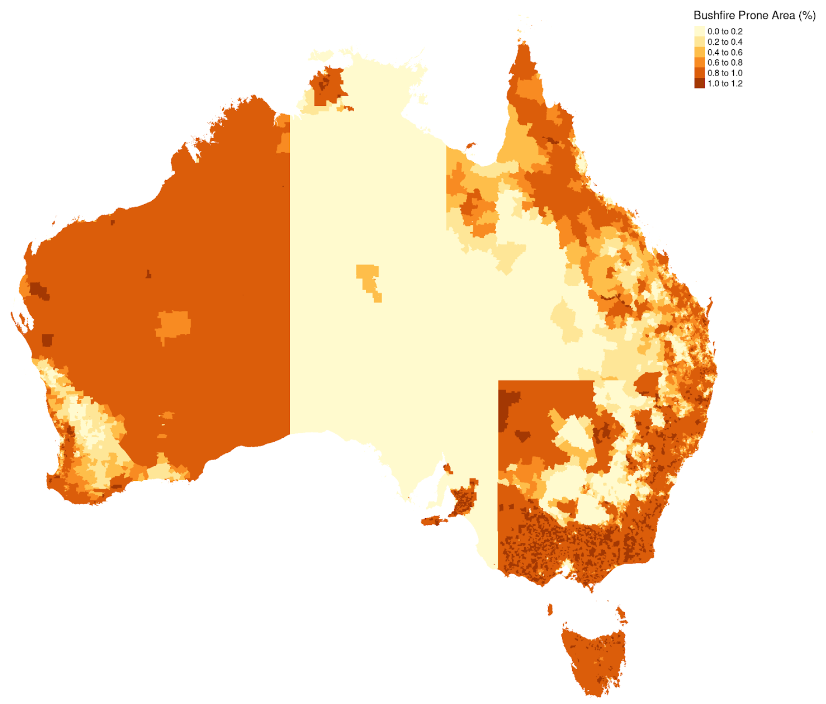

# Bushfire prone land

### [📊&nbsp;Get&nbsp;the&nbsp;data](data) • [💻&nbsp;Reproduce&nbsp;the&nbsp;analysis](#-reproduce-the-analysis)

Visualises how much of each Australia suburb is covered by a state government "bushfire prone area", "fire protection area" or similarly named overlay. Also visualises areas touched by bushfire over the last 40 years.



## ♻️ Use + Remix rights

](https://mirrors.creativecommons.org/presskit/buttons/80x15/png/by.png)

These charts, as well as the analyses that underpin them, are available under a Creative Commons Attribution 4.0 licence. This includes commercial reuse and derivates.

Data in these charts comes from:

* See `data/README.md`

**Please attribute 360info and the data sources when you use and remix these visualisations.**

## 💻 Reproduce the analysis

### Quickstart: use the dev container

This project comes with a ready-to-use [dev container](https://code.visualstudio.com/docs/remote/containers) that includes everything you need to reproduce the analysis (or do a similar one of your own!), including [R](https://r-project.org) and [Quarto](https://quarto.org).

[](https://codespaces.new/360-info/report-bushfire-prone-land?quickstart=1)

Or, if you have Docker installed, you can build and run the container locally:

- Download or clone the project
- Open it in [Visual Studio Code](https://code.visualstudio.com)
- Run the **Remote-Containers: Reopen in Container** command

Once the container has launched (it might take a few minutes to set up the first time), you can run the analysis scripts with:

```sh
quarto render
```

Or look for the `.qmd` files to modify the analysis.

### Manual setup

To setup a development environment manually, 

You'll need to:
- [Download and install Quarto](https://quarto.org/docs/get-started)
- [Download the install R](https://www.r-project.org)
- Satisfy the R package dependencies. In R:
  * Install the [`renv`](https://rstudio.github.io/renv) package with `install.packages("renv")`,
  * Then run `renv::restore()` to install the R package dependencies.
  * (For problems satisfying R package dependencies, refer to [Quarto's documentation on virtual environments](https://quarto.org/docs/projects/virtual-environments.html).)

Now, render the `.qmd` files to the `/out` directory with:

```sh
quarto render
```

## ❓ Help

If you find any problems with our analysis or charts, please feel free to [create an issue](https://github.com/360-info/report-bushfire-prone-land/issues/new)!
